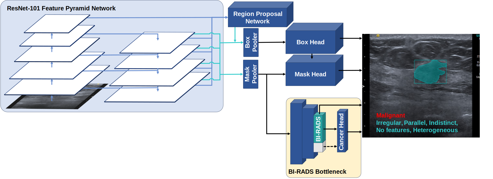
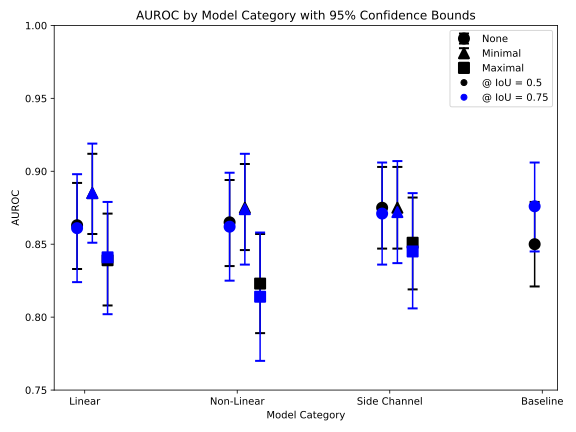

# BI-RADS CBM
---
## Learning a Clinically-Relevant Concept Bottleneck for Lesion Detection in Breast Ultrasound 
###### Github repository containing all relevant code for MICCAI 2024 submission 
This repository is designed to provide implementations of the training and validation scripts for our breast ultrasound (BUS) concept bottleneck model (CBM) from the ACR Breast Imaging and Reporting Data System (BI-RADS) masses lexicon for ultrasound, for lesion detection, description, and cancer classification. 

### Architecture overview:


### Results


## Installation and system requirements
- Tested on Ubuntu 20.04.6 LTS
- Python version: 3.9.16
- To install dependencies, run:
```python3
python setup.py install
```
## Demo
- Demo scripts are provided in the notebooks folder.
- Model weights and configuration files are provided in the models and configs folders, respectively. A model's architecture is completely specified by its config. 
- A demo dataset is provided purely to validate model functionality, the dataset is not representative of the complete dataset used to train/evaluate the models in the manuscript.
- To validate code functionality, run sample code in notebook corresponding to desired functionality (e.g. for an example of how to load and test pretrained models)
    - `model_eval.ipynb` for sample COCO-style evaluation scripts
    - `model_train.py` for sample model training script
    - `visualization.ipynb` for sample visualization of a model rediction from one of the pretrained models
